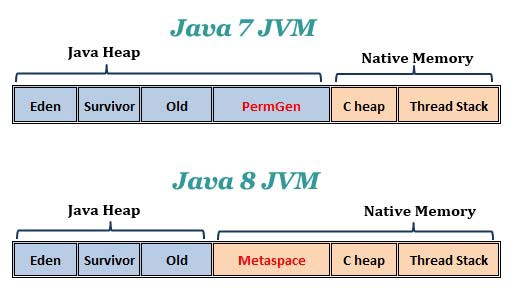

# 7. ETC

### 어노테이션의 변화


[어노테이션 기본 내용]

**@Target**

- 자신이 만든 어노테이션이 사용할 자바 요소를 지정

**@Retention**

- 어노테이션의 유지 기간을 지정
- `@Retention(RetentionPolicy.SOURCE)`
  - 소스 코드(`.java`)까지만 유지
  - ex. @Getter, @Setter

- `@Retention(RetentionPolicy.CLASS)`
  - 컴파일 이후 클래스 파일(`.class`)까지만 유지
  - ex. @NonNull
-  `@Retention(RetentionPolicy.RUNTIME)`
  - 런타임 시점까지 유지
  - ex. @Component, @Controller, @Autowired


[Java 8에서의 변화]

1. Java 8에서는 @Target 요소에 2가지가 추가되었다.

- `@Target(ElementType.TYPE_PARAMETER)`
  - 어노테이션을 제네릭의 타입 파라미터에 사용할 수 있다.
- `@Target(ElementType.TYPE_USE)`
  - 어노테이션을 타입 파라미터를 포함한 모든 타입 선언부에 사용할 수 있다.


2. Java 8부터는 어노테이션을 중복해서 사용할 수 있다.

- `@Repeatable` 어노테이션에 컨테이너 어노테이션을 지정하는 방식으로 가능하다.
- 이때, 컨테이너 어노테이션의 @Retention 및 @Target이 감싸는 어노테이션의 @Retention 및 @Target보다 더 넓거나 같아야 한다.
  - ex. 아래 코드에서, Pizza 어노테이션의 @Target이 TYPE_USE인데, 이를 감싸는 PizzaContainer 어노테이션의 @Target이 TYPE_USE보다 좁은 TYPE_PARAMETER이면 안 된다.

```java
// Pizza.java
@Retention(RetentionPolicy.RUNTIME)
@Target(ElementType.TYPE_USE)
@Repeatable(PizzaContainer.class)    // @Repeatable에 컨테이너 어노테이션 설정
public @interface Pizza {
    String value();
}


// PizzaContainer.java
@Retention(RetentionPolicy.RUNTIME)
@Target(ElementType.TYPE_USE)
public @interface PizzaContainer {

    Pizza[] value();
}


// Bar.java
@Pizza("페퍼로니")
@Pizza("하와이안")
public class Bar {
    public static void main(String[] args) {
        Pizza[] pizzas = Bar.class.getAnnotationsByType(Pizza.class);
        Arrays.stream(pizzas).forEach(p -> {
            System.out.println(p.value());
        });
    }
}
```

<br>

### 배열 병렬 정렬

`Arrays.parallelSort()`

- Fork/Join 프레임워크를 사용해서 배열을 **병렬로 정렬**한다.
- 배열을 쪼갠 뒤 합치면서 정렬하는 방식으로 정렬한다.
- `Arrays.sort()`는 **싱글 스레드** 방식이다.
- `Arrays.parallelSort()`는 **멀티 스레드** 방식이다.


(이미지 출처 : https://www.javacodegeeks.com/2013/04/arrays-sort-versus-arrays-parallelsort.html)

- 위 표를 보면 알 수 있듯, 데이터의 크기가 작은 경우 `Arrays.sort()`가 더 빠르기도 하지만, 데이터의 크기가 커질수록 `Arrays.parallelSort()`가 훨씬 빠르다. 
- 따라서 데이터의 크기, 정렬된 정도 등에 따라 적절한 메소드를 선택하면 된다.

<br>

### Metaspace

> Java 8에서 JVM의 PermGen 메모리 영역이 Metaspace 영역으로 대체되었다.



(이미지 출처 : https://www.programmersought.com/article/4905216600/)


**PermGen**

- permanent generation, 클래스 메타 데이터를 담는 곳
- **Heap 영역에 속한다.**
- 기본값으로 제한된 크기를 가지고 있다.
-  `-XX:PermSize=N` => PermGen 초기 사이즈 설정
- `-XX:MaxPermSize=N` => PermGen 최대 사이즈 설정

**Metaspace**

- permGen과 마찬가지로 클래스 메타 데이터를 담는 곳
- Heap 영역이 아니라 **Native 메모리 영역에 속한다.**
- 기본값으로 제한된 크기를 가지고 있지 않으며, 필요한 만큼 계속 늘어난다.
- `-XX:MetaspaceSize=N` => Metaspace 초기 사이즈 설정
- `-XX:MaxMetaspaceSize=N` =>Metaspace 최대 사이즈 설정


그렇다면 PermGen 영역은 왜 Metaspace 영역으로 대체되었을까?

- Heap 영역은 JVM에 의해 관리되며, Native 메모리 영역은 OS에 의해 관리된다.
- PermGen은 고정된 최대 크기를 가지며, 메타 데이터가 해당 크기를 넘어가면 **OutOfMemoryError**가 발생한다.
- 반면 Metaspace는 Native 메모리 영역에 포함되므로, 사용 가능한 최대 크기는 메모리 전체의 사용 가능 크기에 가깝다. (물론 `-XX:MaxMetaspaceSize=N` 옵션을 통해 최대 크기를 제한할 수는 있다.) 따라서 개발자가 OutOfMemoryError를 걱정할 필요가 크게 줄어들었다.

